# Vault of Digital Content iOS App

PO Requirements:

Idea:
An iOS application called the Vault of Digital Content.
It is available in two languages: Russian and English.
Main goal: Allow users to store information for future reference as a Real Later, but it should be extended to four categories: Watch Later (videos, films, movies, etc.), Read Later (books, articles, posts), Buy Later (products from marketplaces, stores, etc.), and Cook Later (recipes that users have seen and want to cook later).
Users can share URLs of interesting content with the app, which then suggests prefilled data (image, title, description, type, etc.). Users can customize this content or simply save it to the appropriate category. Potentially, AI features could be added, such as AI search by name and type, or AI suggestions based on the already saved Watch list, suggesting interesting films. Additionally, some random notifications will be sent to users to encourage them to watch or book something from their list. Users can edit or delete each item.
There will be free capabilities for users and a Pro version of the app available by subscription or lifetime purchase.


Market Analysis: Vault of Digital Content
1. Market Size & Growth Trends
* The global productivity apps market was valued at $9.65 billion in 2024 and is projected to continue growing, indicating a healthy environment for personal content management tools.
* The "save for later" niche is experiencing a shake-up, especially after the shutdown of Pocket (which had over 20 million users) in July 2025. This has created a significant opportunity for new entrants to capture displaced users.
* The iOS platform is particularly attractive, as its user base is more likely to pay for premium features and subscriptions.
* In Russia, the productivity app market was estimated at $448.78 million in 2024 and is growing, though local platforms like VK and Telegram are dominant. Bilingual (Russian/English) support is a differentiator, as bilingual content consumption is on the rise and not fully addressed by current competitors[1].
2. Target User Segments
* The app targets a broad audience: anyone who wants to save content for later, regardless of age or tech-savviness.
* Likely power users include busy professionals, students, avid content consumers, and productivity enthusiasts.
* Bilingual users (Russian/English) are a unique segment, especially those who consume content in both languages and need cross-language organization.
3. Competitive Landscape
* With Pocket's exit, Instapaper and Readwise Reader are the main competitors, each with distinct strengths (minimalism vs. advanced features).
* Other players include Matter, Flyleaf (iOS-focused), and indirect competitors like Notion, Evernote, and Pinterest.
* Many competitors focus on a single content type (e.g., reading), while Vault’s four-category approach (Watch, Read, Buy, Cook) is a unique selling point.
* The free version’s limitations (restricted to 3-4 top resources per category and 30 total records) are similar to freemium models used by competitors, but the breadth of supported platforms in the Pro version could be a strong differentiator[1].
4. Unique Value Proposition
* Unified storage for diverse content types (videos, articles, products, recipes) in one app.
* Bilingual support for Russian and English users.
* Planned AI-powered features for future releases (recommendations, smart search).
* Simple privacy model: only authentication data is stored, reducing privacy risks and simplifying compliance.
5. Potential Challenges & Risks
* User Adoption: Competing with established apps and built-in platform features (e.g., Safari Reading List).
* Platform Support: Limiting full platform support to Pro users may slow initial adoption, as users often expect broad compatibility for free.
* AI Feature Rollout: Delaying AI features could make it harder to stand out initially, as competitors are already integrating AI.
* No Integrations: Lack of browser or messaging app integration may reduce convenience for some users.
* Local Market Dynamics: In Russia, preference for local platforms and alternative app stores could affect adoption.

Summary & Recommendations
Overall Market Potential:
The Vault of Digital Content enters a market in flux, with a major competitor (Pocket) recently exiting and a large user base seeking alternatives. Its multi-category approach, bilingual support, and privacy simplicity are strong differentiators. The iOS market is lucrative, and the Russian market is growing, though it presents unique challenges.
Recommendations:
* Early User Feedback: Launch a beta to gather feedback on category usefulness and free/pro feature balance.
* Competitive Benchmarking: Monitor how Instapaper, Readwise Reader, and others respond to Pocket’s exit and adjust positioning accordingly.
* AI Roadmap: Communicate clearly about upcoming AI features to build anticipation and retain users.
* Consider Integrations: Explore lightweight integrations (e.g., iOS share sheet) to improve content capture convenience.
* Localization: Ensure seamless experience for both Russian and English users, possibly adding in-app translation or language detection.
Would you like a deeper dive into user personas, a feature prioritization matrix, or a more detailed competitor analysis? Your feedback will help refine the next steps.[1]


Restrictions: first MVP will be free for users and suggest only limited functionalities, 30 records total limit, Ads integrated, and only Youtube, Instagram, Amazon, Apple Books available sources for automatic parsing from shared URL. Pro version will have unlimited records numbers,  no Ads, much more sources to parse data by url sharing, sync data with Icloud and famili sharing.


1. AI Tools for Design, Color, and Fonts
A. Design & UI Mockups
* Figma + AI Plugins
    * Figma is the industry standard for UI/UX design and prototyping.
    * AI Plugins for Figma:
        * Magician: Generates UI elements, icons, and copy with AI.
        * ColorMind: AI-powered color palette generator.
        * Fontjoy: Suggests font pairings using AI.
        * Wireframe Designer: Instantly creates wireframes from prompts.
    * How to Use: Design your screens in Figma, use plugins to generate palettes, font pairings, and wireframes, then export assets for Xcode.
* Uizard
    * Converts hand-drawn sketches or text prompts into digital wireframes and mockups using AI.
    * Great for rapid prototyping and iterating on ideas.
B. Color & Font Selection
* Colormind.io or Khroma
    * AI-driven color palette generators. Input your vibe (minimal, Apple-like) and get palettes that work well together.
* Fontjoy or Google Fonts + AI Pairings
    * Generate harmonious font pairings. Stick to Apple’s San Francisco for a native feel, but these tools help if you want alternatives.
C. Asset Generation
* DALL·E or Midjourney
    * For unique icons or illustrations, use AI image generators. Ensure you use SVG/PNG exports for Xcode.

2. AI-Powered Coding Tools for Xcode Integration
A. Code Generation & Assistance
* GitHub Copilot
    * AI pair programmer that works inside Xcode (via JetBrains or VSCode, or with Copilot Chat for Mac).
    * Suggests Swift code, UI layouts, and even helps with bug fixes.
* Amazon CodeWhisperer
    * Similar to Copilot, offers code completions and suggestions for Swift and iOS development.
* ChatGPT (OpenAI)
    * Use for generating Swift code snippets, regex, or logic explanations. You can copy-paste code into Xcode.
B. UI to Code
* Figma to Xcode Plugins
    * Figma to Code: Exports Figma designs directly to SwiftUI code.
    * Zeplin: Bridges design and development, providing specs and assets for Xcode.
C. Testing & Debugging
* Xcode’s Built-in AI (Xcode 15+)
    * Leverage Xcode’s new AI-powered code completion and refactoring tools.

Minimum IOS version is 17.0
3. Implementation Solutions for Each Screen & Feature (Swift, SwiftUI, Combne, Structured Concurency, Swift Data.)
A. Onboarding & Authentication
* Screen: Welcome (first run), Language Selection (first run), Sign Up/In (Google, Apple, Email), Notification Setup(first run)
* Solution:
    * Use SwiftUI for fast UI development.
    * Integrate Firebase Auth for Google/Email, and Sign in with Apple (Apple’s AuthenticationServices).
    * Use UserDefaults to store language preference.
B. Main Dashboard (4 Categories)
* Screen: TabBar for Watch, Read, Buy, Cook Later.
* Solution:
    * Use TabView (SwiftUI)
    * Each tab displays a list of items (List or LazyVStack in SwiftUI).
C. Add/Edit Item
* Screen: Add new item (via share extension or in-app), edit details. 
* Solution:
    * Implement a Share Extension to receive URLs from other apps.
    * Use Swift Package like SwiftSoup or OpenGraphSwift to parse metadata from URLs.
    * For manual entry, use a simple form (TextFields, Pickers).
    * Store data in Swift Data for local persistence.
D. Item Details & Management
* Screen: View, edit, delete, move items between categories.
* Solution:
    * Detail view with edit/delete buttons.
    * Use Swipe Actions in SwiftUI List for quick delete/edit.
E. Search & Filter
* Screen: Search bar, filter by add date.
* Solution:
    * Use .searchable modifier in SwiftUI for search.
    * Filter items in Swift Data fetch requests.
F. Notifications
* Screen: Settings for notification preferences.
* Solution:
    * Use UNUserNotificationCenter for local notifications.
    * Store user preferences in UserDefaults.
G. Settings
* Screen: Language, notification preferences, account info.
* Solution:
    * Simple form with toggles and pickers.
    * Use AppStorage (SwiftUI) for persistent settings.
H. Localization
* Solution:
    * Use Localizable.strings for Russian and English.
    * Test with Xcode’s localization tools.

4. Integration Workflow
1. Design in Figma/Uizard → Export assets and specs.
2. Generate color palettes and fonts with Colormind/Fontjoy.
3. Use Figma-to-Code plugin to get SwiftUI code for layouts.
4. Set up Xcode project with SwiftUI, Core Data, and Firebase Auth.
5. Use Copilot/CodeWhisperer for rapid code generation and bug fixing.
6. Implement share extension and metadata parsing.
7. Build and test each screen iteratively.
8. Localize strings and test in both languages.
9. Test notifications and settings.
10. Polish UI for Apple-native minimalism.
11. Test on real devices and submit to App Store.

5. Key Recommendations
* Prioritize core flows: Onboarding, adding items, viewing lists.
* Leverage AI tools for speed: Figma plugins, Copilot, code generators.
* Keep UI minimal: Use Apple’s SF Symbols, San Francisco font, and system colors.
* Test early and often: Use TestFlight for beta testing.


# 🏛️ Solution Architecture: Vault of Digital Content iOS App

**Date:** October 18, 2025  
**Architect:** Solution Architecture Team  
**Client:** dzmitry_zaitsau2@epam.com  
**Project:** Vault of Digital Content - iOS Application MVP

---

## 📋 Executive Summary

This document provides a comprehensive solution architecture for the **Vault of Digital Content** iOS application. The app addresses a significant market opportunity created by Pocket's shutdown (July 2025), targeting 20M+ displaced users with a multi-category content management solution.

**Key Differentiators:**
- 4 content categories (Watch, Read, Buy, Cook Later) in one unified app
- Bilingual support (Russian/English)
- Privacy-first approach (minimal data storage)
- iOS 17.0+ leveraging latest Apple technologies

---

## 🎯 Architecture Overview

### High-Level Architecture Diagram

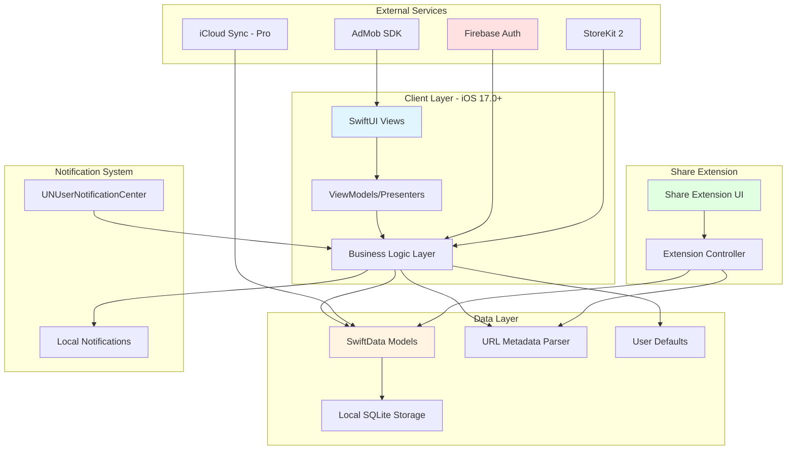

---

## 🏗️ Detailed Architecture Design

### 1. Technology Stack

| Layer | Technology | Version | Justification |
|-------|-----------|---------|---------------|
| **UI Framework** | SwiftUI | iOS 17.0+ | Modern, declarative, excellent performance |
| **Data Persistence** | SwiftData | iOS 17.0+ | Swift-native, reactive, simplified Core Data |
| **Authentication** | Firebase Auth | Latest | Multi-provider support (Google, Apple, Email) |
| **Monetization** | AdMob SDK | 11.0+ | Industry standard, robust ad delivery |
| **In-App Purchase** | StoreKit 2 | iOS 17.0+ | Native subscriptions, modern API |
| **Concurrency** | Structured Concurrency | Swift 5.9+ | async/await, Task groups |
| **Reactive Programming** | Combine | iOS 17.0+ | Data binding, event handling |
| **Localization** | Localizable.strings | Native | Russian/English support |
| **URL Parsing** | OpenGraphReader SPM | Latest | Metadata extraction from URLs |

---

### 2. Application Architecture Pattern

**Recommendation: MVVM + Repository Pattern**

For iOS 17+ with SwiftData and SwiftUI, we'll use a lightweight MVVM pattern with feature-based organization:

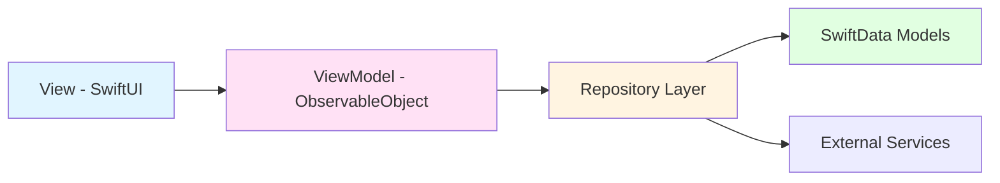

**Why this pattern:**
- SwiftData's `@Query` macro handles much of the data binding
- Feature-based modules (Watch, Read, Buy, Cook) are self-contained
- Repository pattern abstracts data sources (local vs. cloud for Pro)
- Testable and maintainable

---

### 3. Data Architecture

#### SwiftData Models

```swift
import SwiftData
import Foundation

@Model
final class ContentItem {
    @Attribute(.unique) var id: UUID
    var title: String
    var itemDescription: String?
    var imageURL: URL?
    var sourceURL: URL
    var category: ContentCategory
    var sourceType: SourceType
    var dateAdded: Date
    var dateModified: Date
    var isCompleted: Bool
    var customNotes: String?
    
    init(title: String, 
         sourceURL: URL, 
         category: ContentCategory,
         sourceType: SourceType = .unknown) {
        self.id = UUID()
        self.title = title
        self.sourceURL = sourceURL
        self.category = category
        self.sourceType = sourceType
        self.dateAdded = Date()
        self.dateModified = Date()
        self.isCompleted = false
    }
}

enum ContentCategory: String, Codable {
    case watch = "watch"
    case read = "read"
    case buy = "buy"
    case cook = "cook"
}

enum SourceType: String, Codable {
    case youtube = "youtube"
    case instagram = "instagram"
    case amazon = "amazon"
    case appleBooks = "appleBooks"
    case unknown = "unknown"
}

@Model
final class UserPreferences {
    var language: AppLanguage
    var notificationsEnabled: Bool
    var notificationFrequency: NotificationFrequency
    var isPro: Bool
    var subscriptionExpiryDate: Date?
    
    init() {
        self.language = .english
        self.notificationsEnabled = false
        self.notificationFrequency = .weekly
        self.isPro = false
    }
}

enum AppLanguage: String, Codable {
    case english = "en"
    case russian = "ru"
}

enum NotificationFrequency: String, Codable {
    case daily = "daily"
    case weekly = "weekly"
    case monthly = "monthly"
}
```

#### Data Flow Diagram

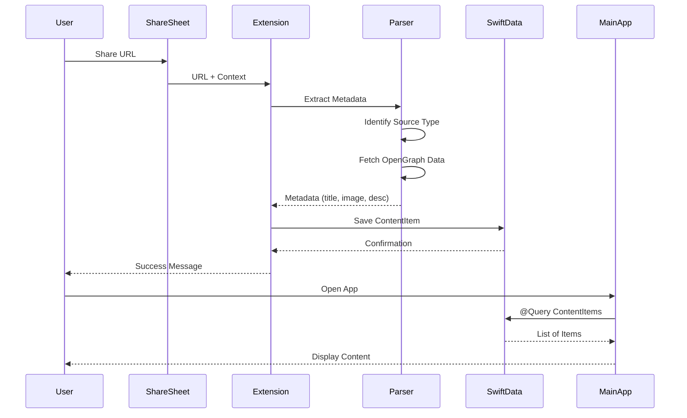

---

### 4. Feature Architecture

#### 4.1 Authentication Flow

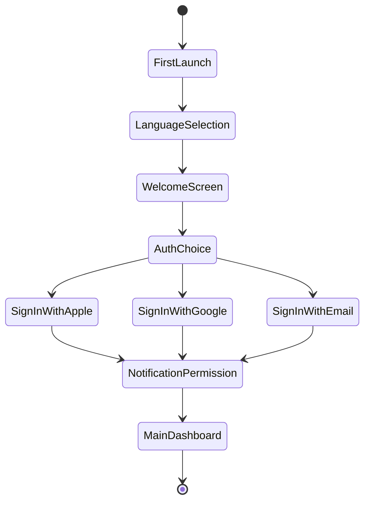

**Implementation Details:**

```swift
import SwiftUI
import FirebaseAuth
import AuthenticationServices

@MainActor
final class AuthenticationViewModel: ObservableObject {
    @Published var authState: AuthState = .unauthenticated
    @Published var errorMessage: String?
    
    enum AuthState {
        case unauthenticated
        case authenticating
        case authenticated(User)
    }
    
    func signInWithApple() async {
        authState = .authenticating
        
        let request = ASAuthorizationAppleIDProvider().createRequest()
        request.requestedScopes = [.email, .fullName]
        
        do {
            let result = try await ASAuthorizationController(
                authorizationRequests: [request]
            ).performRequests()
            
            // Handle Firebase Auth integration
            // ... implementation
            
        } catch {
            errorMessage = error.localizedDescription
            authState = .unauthenticated
        }
    }
    
    func signInWithGoogle() async {
        // Firebase Google Sign-In implementation
    }
    
    func signInWithEmail(email: String, password: String) async {
        // Firebase Email Sign-In implementation
    }
}
```

#### 4.2 URL Metadata Parsing Architecture

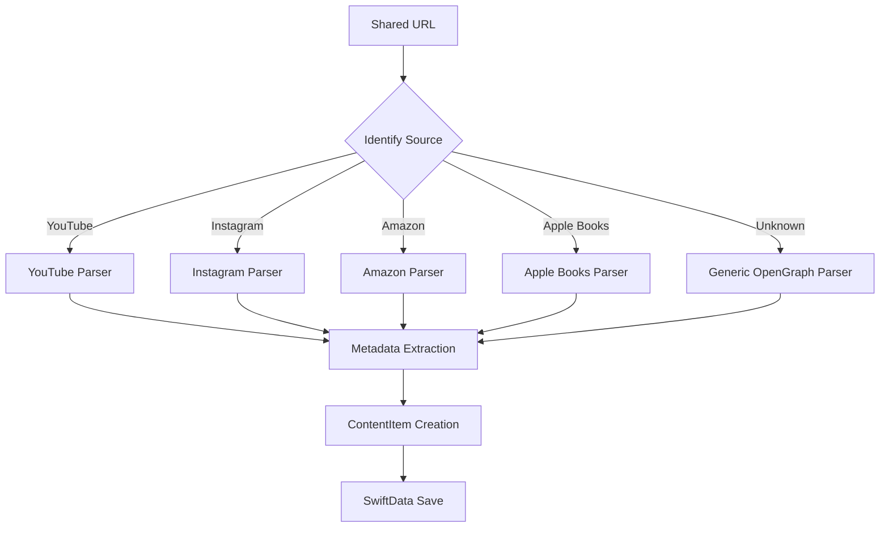

**Implementation:**

```swift
import Foundation

protocol MetadataParser {
    func canParse(url: URL) -> Bool
    func parse(url: URL) async throws -> ParsedMetadata
}

struct ParsedMetadata {
    let title: String
    let description: String?
    let imageURL: URL?
    let sourceType: SourceType
}

final class MetadataParserService {
    private let parsers: [MetadataParser]
    
    init() {
        self.parsers = [
            YouTubeParser(),
            InstagramParser(),
            AmazonParser(),
            AppleBooksParser(),
            OpenGraphParser() // Fallback
        ]
    }
    
    func parse(url: URL) async throws -> ParsedMetadata {
        guard let parser = parsers.first(where: { $0.canParse(url: url) }) else {
            throw ParsingError.unsupportedURL
        }
        
        return try await parser.parse(url: url)
    }
}

// Example: YouTube Parser
final class YouTubeParser: MetadataParser {
    func canParse(url: URL) -> Bool {
        url.host?.contains("youtube.com") == true || 
        url.host?.contains("youtu.be") == true
    }
    
    func parse(url: URL) async throws -> ParsedMetadata {
        // Extract video ID
        // Fetch video metadata using OpenGraph or YouTube API
        // Return ParsedMetadata
    }
}

// Generic OpenGraph Parser using OpenGraphReader SPM
import OpenGraphReader

final class OpenGraphParser: MetadataParser {
    func canParse(url: URL) -> Bool {
        return true // Fallback for all URLs
    }
    
    func parse(url: URL) async throws -> ParsedMetadata {
        let reader = OpenGraphReader()
        let response = try await reader.fetch(url: url)
        
        return ParsedMetadata(
            title: response.title ?? url.absoluteString,
            description: response.description,
            imageURL: response.imageUrl,
            sourceType: .unknown
        )
    }
}
```

#### 4.3 Share Extension Architecture

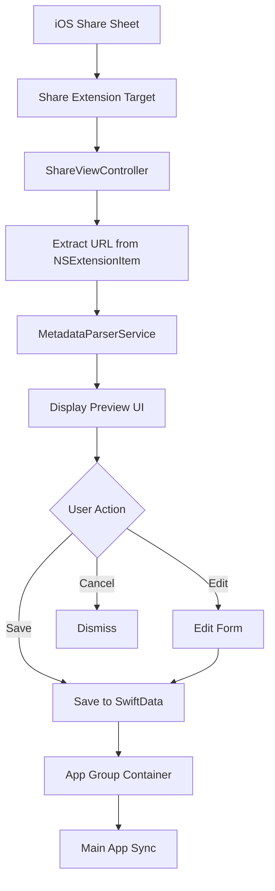

**Implementation:**

```swift
import SwiftUI
import UniformTypeIdentifiers

class ShareViewController: UIViewController {
    override func viewDidLoad() {
        super.viewDidLoad()
        
        guard let extensionItem = extensionContext?.inputItems.first as? NSExtensionItem,
              let itemProvider = extensionItem.attachments?.first else {
            close()
            return
        }
        
        if itemProvider.hasItemConformingToTypeIdentifier(UTType.url.identifier) {
            itemProvider.loadItem(forTypeIdentifier: UTType.url.identifier) { [weak self] (url, error) in
                guard let url = url as? URL else {
                    self?.close()
                    return
                }
                
                Task { @MainActor in
                    await self?.handleURL(url)
                }
            }
        }
    }
    
    @MainActor
    private func handleURL(_ url: URL) async {
        let hostingController = UIHostingController(
            rootView: ShareExtensionView(
                url: url,
                onSave: { [weak self] in
                    self?.close()
                },
                onCancel: { [weak self] in
                    self?.close()
                }
            )
        )
        
        addChild(hostingController)
        view.addSubview(hostingController.view)
        hostingController.view.frame = view.bounds
        hostingController.didMove(toParent: self)
    }
    
    private func close() {
        extensionContext?.completeRequest(returningItems: nil)
    }
}

struct ShareExtensionView: View {
    let url: URL
    let onSave: () -> Void
    let onCancel: () -> Void
    
    @State private var metadata: ParsedMetadata?
    @State private var selectedCategory: ContentCategory = .watch
    @State private var isLoading = true
    
    var body: some View {
        NavigationView {
            Form {
                if isLoading {
                    ProgressView("Loading metadata...")
                } else if let metadata = metadata {
                    Section("Preview") {
                        if let imageURL = metadata.imageURL {
                            AsyncImage(url: imageURL) { image in
                                image.resizable()
                                    .aspectRatio(contentMode: .fit)
                                    .frame(maxHeight: 200)
                            } placeholder: {
                                ProgressView()
                            }
                        }
                        
                        Text(metadata.title)
                            .font(.headline)
                        
                        if let description = metadata.description {
                            Text(description)
                                .font(.caption)
                                .foregroundColor(.secondary)
                        }
                    }
                    
                    Section("Category") {
                        Picker("Select Category", selection: $selectedCategory) {
                            Text("Watch Later").tag(ContentCategory.watch)
                            Text("Read Later").tag(ContentCategory.read)
                            Text("Buy Later").tag(ContentCategory.buy)
                            Text("Cook Later").tag(ContentCategory.cook)
                        }
                        .pickerStyle(.segmented)
                    }
                }
            }
            .navigationTitle("Save to Vault")
            .navigationBarTitleDisplayMode(.inline)
            .toolbar {
                ToolbarItem(placement: .cancellationAction) {
                    Button("Cancel", action: onCancel)
                }
                ToolbarItem(placement: .confirmationAction) {
                    Button("Save") {
                        saveItem()
                        onSave()
                    }
                    .disabled(metadata == nil)
                }
            }
        }
        .task {
            await loadMetadata()
        }
    }
    
    private func loadMetadata() async {
        let parser = MetadataParserService()
        do {
            metadata = try await parser.parse(url: url)
            isLoading = false
        } catch {
            isLoading = false
            // Handle error
        }
    }
    
    private func saveItem() {
        guard let metadata = metadata else { return }
        
        // Save to SwiftData using shared App Group container
        let modelContainer = try? ModelContainer(
            for: ContentItem.self,
            configurations: ModelConfiguration(
                groupContainer: .identifier("group.com.yourcompany.vault")
            )
        )
        
        let item = ContentItem(
            title: metadata.title,
            sourceURL: url,
            category: selectedCategory,
            sourceType: metadata.sourceType
        )
        item.itemDescription = metadata.description
        item.imageURL = metadata.imageURL
        
        modelContainer?.mainContext.insert(item)
        try? modelContainer?.mainContext.save()
    }
}
```

---

### 5. Main App Architecture

#### 5.1 Navigation Structure

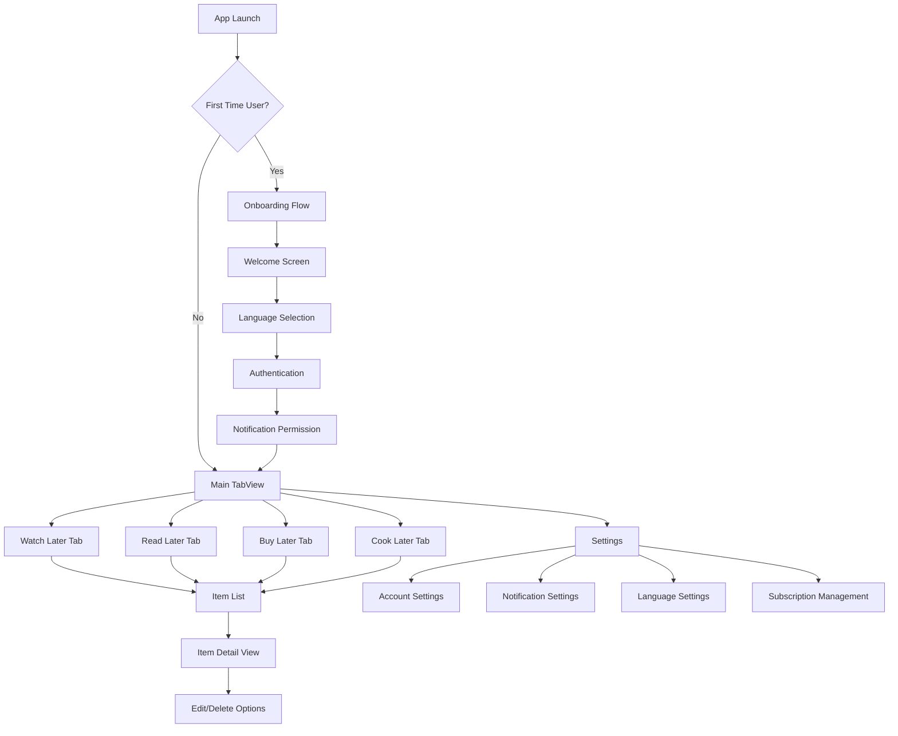

#### 5.2 Main App Structure

```swift
import SwiftUI
import SwiftData

@main
struct VaultApp: App {
    @StateObject private var authViewModel = AuthenticationViewModel()
    @StateObject private var subscriptionManager = SubscriptionManager()
    
    let modelContainer: ModelContainer
    
    init() {
        do {
            let configuration = ModelConfiguration(
                groupContainer: .identifier("group.com.yourcompany.vault")
            )
            modelContainer = try ModelContainer(
                for: ContentItem.self, UserPreferences.self,
                configurations: configuration
            )
        } catch {
            fatalError("Failed to initialize ModelContainer: \(error)")
        }
    }
    
    var body: some Scene {
        WindowGroup {
            ContentView()
                .environmentObject(authViewModel)
                .environmentObject(subscriptionManager)
                .modelContainer(modelContainer)
        }
    }
}

struct ContentView: View {
    @EnvironmentObject var authViewModel: AuthenticationViewModel
    @AppStorage("hasCompletedOnboarding") private var hasCompletedOnboarding = false
    
    var body: some View {
        Group {
            switch authViewModel.authState {
            case .authenticated where hasCompletedOnboarding:
                MainTabView()
            case .authenticated:
                OnboardingFlow(onComplete: {
                    hasCompletedOnboarding = true
                })
            case .authenticating:
                ProgressView("Authenticating...")
            case .unauthenticated:
                AuthenticationView()
            }
        }
    }
}

struct MainTabView: View {
    @EnvironmentObject var subscriptionManager: SubscriptionManager
    
    var body: some View {
        TabView {
            ContentListView(category: .watch)
                .tabItem {
                    Label("Watch", systemImage: "play.rectangle")
                }
            
            ContentListView(category: .read)
                .tabItem {
                    Label("Read", systemImage: "book")
                }
            
            ContentListView(category: .buy)
                .tabItem {
                    Label("Buy", systemImage: "cart")
                }
            
            ContentListView(category: .cook)
                .tabItem {
                    Label("Cook", systemImage: "fork.knife")
                }
            
            SettingsView()
                .tabItem {
                    Label("Settings", systemImage: "gear")
                }
        }
        .overlay(alignment: .bottom) {
            if !subscriptionManager.isPro {
                AdBannerView()
                    .frame(height: 50)
            }
        }
    }
}
```

#### 5.3 Content List View

```swift
import SwiftUI
import SwiftData

struct ContentListView: View {
    let category: ContentCategory
    
    @Query private var items: [ContentItem]
    @State private var searchText = ""
    @State private var showingAddSheet = false
    @EnvironmentObject var subscriptionManager: SubscriptionManager
    
    init(category: ContentCategory) {
        self.category = category
        let predicate = #Predicate<ContentItem> { item in
            item.category == category
        }
        _items = Query(filter: predicate, sort: \.dateAdded, order: .reverse)
    }
    
    var filteredItems: [ContentItem] {
        if searchText.isEmpty {
            return items
        }
        return items.filter { item in
            item.title.localizedCaseInsensitiveContains(searchText) ||
            (item.itemDescription?.localizedCaseInsensitiveContains(searchText) ?? false)
        }
    }
    
    var body: some View {
        NavigationStack {
            Group {
                if items.isEmpty {
                    ContentUnavailableView {
                        Label("No Items", systemImage: categoryIcon)
                    } description: {
                        Text("Start saving \(category.rawValue) content")
                    } actions: {
                        Button("Add Item") {
                            showingAddSheet = true
                        }
                    }
                } else {
                    List {
                        ForEach(filteredItems) { item in
                            NavigationLink(destination: ItemDetailView(item: item)) {
                                ItemRowView(item: item)
                            }
                        }
                        .onDelete(perform: deleteItems)
                    }
                    .searchable(text: $searchText, prompt: "Search \(category.rawValue)")
                }
            }
            .navigationTitle("\(category.rawValue.capitalized) Later")
            .toolbar {
                ToolbarItem(placement: .primaryAction) {
                    Button {
                        showingAddSheet = true
                    } label: {
                        Image(systemName: "plus")
                    }
                }
            }
            .sheet(isPresented: $showingAddSheet) {
                AddItemView(category: category)
            }
            .alert("Item Limit Reached", isPresented: $showingLimitAlert) {
                Button("Upgrade to Pro") {
                    // Navigate to subscription
                }
                Button("Cancel", role: .cancel) {}
            } message: {
                Text("Free users are limited to 30 items. Upgrade to Pro for unlimited storage.")
            }
        }
    }
    
    private var showingLimitAlert: Binding<Bool> {
        Binding(
            get: { !subscriptionManager.isPro && items.count >= 30 },
            set: { _ in }
        )
    }
    
    private var categoryIcon: String {
        switch category {
        case .watch: return "play.rectangle"
        case .read: return "book"
        case .buy: return "cart"
        case .cook: return "fork.knife"
        }
    }
    
    private func deleteItems(at offsets: IndexSet) {
        // Delete implementation
    }
}

struct ItemRowView: View {
    let item: ContentItem
    
    var body: some View {
        HStack(spacing: 12) {
            if let imageURL = item.imageURL {
                AsyncImage(url: imageURL) { image in
                    image
                        .resizable()
                        .aspectRatio(contentMode: .fill)
                } placeholder: {
                    Rectangle()
                        .fill(Color.gray.opacity(0.2))
                }
                .frame(width: 60, height: 60)
                .clipShape(RoundedRectangle(cornerRadius: 8))
            }
            
            VStack(alignment: .leading, spacing: 4) {
                Text(item.title)
                    .font(.headline)
                    .lineLimit(2)
                
                if let description = item.itemDescription {
                    Text(description)
                        .font(.caption)
                        .foregroundColor(.secondary)
                        .lineLimit(2)
                }
                
                HStack {
                    Image(systemName: sourceIcon(for: item.sourceType))
                        .font(.caption)
                        .foregroundColor(.secondary)
                    
                    Text(item.dateAdded, style: .relative)
                        .font(.caption)
                        .foregroundColor(.secondary)
                }
            }
        }
        .padding(.vertical, 4)
    }
    
    private func sourceIcon(for type: SourceType) -> String {
        switch type {
        case .youtube: return "play.rectangle.fill"
        case .instagram: return "camera.fill"
        case .amazon: return "cart.fill"
        case .appleBooks: return "book.fill"
        case .unknown: return "link"
        }
    }
}
```

---

### 6. Monetization Architecture

#### 6.1 AdMob Integration (Free Tier)

```swift
import SwiftUI
import GoogleMobileAds

struct AdBannerView: UIViewRepresentable {
    let adUnitID: String = "ca-app-pub-3940256099942544/2934735716" // Test ID
    
    func makeUIView(context: Context) -> GADBannerView {
        let banner = GADBannerView(adSize: GADAdSizeBanner)
        banner.adUnitID = adUnitID
        banner.rootViewController = UIApplication.shared.getRootViewController()
        banner.load(GADRequest())
        return banner
    }
    
    func updateUIView(_ uiView: GADBannerView, context: Context) {}
}

extension UIApplication {
    func getRootViewController() -> UIViewController {
        guard let screen = connectedScenes.first as? UIWindowScene,
              let root = screen.windows.first?.rootViewController else {
            return UIViewController()
        }
        return root
    }
}
```

#### 6.2 StoreKit 2 Subscription Implementation

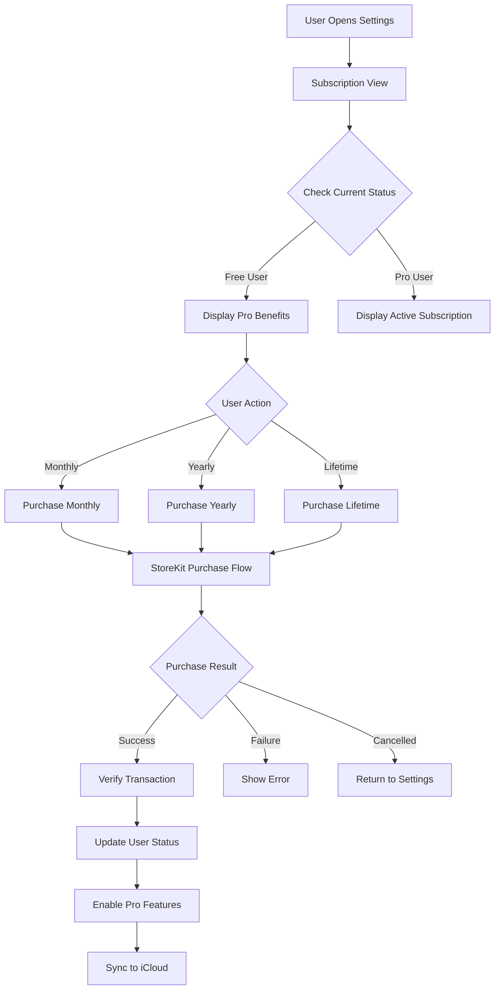

**Implementation:**

```swift
import StoreKit
import SwiftUI

@MainActor
final class SubscriptionManager: ObservableObject {
    @Published private(set) var isPro: Bool = false
    @Published private(set) var products: [Product] = []
    @Published private(set) var purchasedProductIDs: Set<String> = []
    
    private let productIDs: [String] = [
        "com.vault.pro.monthly",
        "com.vault.pro.yearly",
        "com.vault.pro.lifetime"
    ]
    
    init() {
        Task {
            await loadProducts()
            await updatePurchasedProducts()
        }
    }
    
    func loadProducts() async {
        do {
            products = try await Product.products(for: productIDs)
        } catch {
            print("Failed to load products: \(error)")
        }
    }
    
    func purchase(_ product: Product) async throws -> Transaction? {
        let result = try await product.purchase()
        
        switch result {
        case .success(let verification):
            let transaction = try checkVerified(verification)
            await updatePurchasedProducts()
            await transaction.finish()
            return transaction
            
        case .userCancelled:
            return nil
            
        case .pending:
            return nil
            
        @unknown default:
            return nil
        }
    }
    
    func updatePurchasedProducts() async {
        var purchasedIDs: Set<String> = []
        
        for await result in Transaction.currentEntitlements {
            guard case .verified(let transaction) = result else {
                continue
            }
            
            if transaction.revocationDate == nil {
                purchasedIDs.insert(transaction.productID)
            }
        }
        
        self.purchasedProductIDs = purchasedIDs
        self.isPro = !purchasedIDs.isEmpty
    }
    
    func restorePurchases() async {
        try? await AppStore.sync()
        await updatePurchasedProducts()
    }
    
    private func checkVerified<T>(_ result: VerificationResult<T>) throws -> T {
        switch result {
        case .unverified:
            throw StoreError.failedVerification
        case .verified(let safe):
            return safe
        }
    }
}

enum StoreError: Error {
    case failedVerification
}

// Subscription View
struct SubscriptionView: View {
    @EnvironmentObject var subscriptionManager: SubscriptionManager
    @State private var isPurchasing = false
    
    var body: some View {
        List {
            if subscriptionManager.isPro {
                Section {
                    Label("Pro Active", systemImage: "checkmark.circle.fill")
                        .foregroundColor(.green)
                }
            } else {
                Section("Pro Features") {
                    FeatureRow(icon: "infinity", text: "Unlimited items")
                    FeatureRow(icon: "nosign", text: "No advertisements")
                    FeatureRow(icon: "link", text: "Support for all sources")
                    FeatureRow(icon: "icloud", text: "iCloud sync")
                    FeatureRow(icon: "person.2", text: "Family sharing")
                }
                
                Section("Choose Your Plan") {
                    ForEach(subscriptionManager.products) { product in
                        SubscriptionProductRow(
                            product: product,
                            isPurchasing: $isPurchasing
                        )
                    }
                }
            }
            
            Section {
                Button("Restore Purchases") {
                    Task {
                        await subscriptionManager.restorePurchases()
                    }
                }
            }
        }
        .navigationTitle("Subscription")
    }
}

struct SubscriptionProductRow: View {
    let product: Product
    @Binding var isPurchasing: Bool
    @EnvironmentObject var subscriptionManager: SubscriptionManager
    
    var body: some View {
        HStack {
            VStack(alignment: .leading) {
                Text(product.displayName)
                    .font(.headline)
                Text(product.description)
                    .font(.caption)
                    .foregroundColor(.secondary)
            }
            
            Spacer()
            
            Button(action: purchase) {
                if isPurchasing {
                    ProgressView()
                } else {
                    Text(product.displayPrice)
                        .bold()
                }
            }
            .buttonStyle(.borderedProminent)
            .disabled(isPurchasing)
        }
    }
    
    private func purchase() {
        isPurchasing = true
        Task {
            do {
                _ = try await subscriptionManager.purchase(product)
            } catch {
                print("Purchase failed: \(error)")
            }
            isPurchasing = false
        }
    }
}

struct FeatureRow: View {
    let icon: String
    let text: String
    
    var body: some View {
        Label(text, systemImage: icon)
    }
}
```

---

### 7. Notification System

```swift
import UserNotifications
import SwiftUI

@MainActor
final class NotificationManager: ObservableObject {
    @Published var isAuthorized = false
    
    func requestAuthorization() async {
        do {
            isAuthorized = try await UNUserNotificationCenter.current()
                .requestAuthorization(options: [.alert, .sound, .badge])
        } catch {
            print("Failed to request notification authorization: \(error)")
        }
    }
    
    func scheduleRandomReminders(for items: [ContentItem]) {
        // Remove existing notifications
        UNUserNotificationCenter.current().removeAllPendingNotificationRequests()
        
        // Schedule up to 3 random reminders per week
        let selectedItems = items.shuffled().prefix(3)
        
        for (index, item) in selectedItems.enumerated() {
            let content = UNMutableNotificationContent()
            content.title = "Remember to \(item.category.rawValue)!"
            content.body = item.title
            content.sound = .default
            
            if let imageURL = item.imageURL {
                // Attach image if available
                Task {
                    if let attachment = try? await createAttachment(from: imageURL) {
                        content.attachments = [attachment]
                    }
                }
            }
            
            // Random time in next 7 days
            let daysAhead = Int.random(in: 1...7)
            var dateComponents = DateComponents()
            dateComponents.day = daysAhead
            dateComponents.hour = Int.random(in: 10...20)
            
            let trigger = UNCalendarNotificationTrigger(
                dateMatching: dateComponents,
                repeats: false
            )
            
            let request = UNNotificationRequest(
                identifier: "reminder-\(item.id.uuidString)",
                content: content,
                trigger: trigger
            )
            
            UNUserNotificationCenter.current().add(request) { error in
                if let error = error {
                    print("Failed to schedule notification: \(error)")
                }
            }
        }
    }
    
    private func createAttachment(from imageURL: URL) async throws -> UNNotificationAttachment {
        let (data, _) = try await URLSession.shared.data(from: imageURL)
        let tempDirectory = FileManager.default.temporaryDirectory
        let tempFile = tempDirectory.appendingPathComponent(UUID().uuidString + ".jpg")
        try data.write(to: tempFile)
        return try UNNotificationAttachment(
            identifier: UUID().uuidString,
            url: tempFile,
            options: nil
        )
    }
}
```

---

### 8. Localization Architecture

#### Localization Structure

```
VaultApp/
├── Resources/
│   ├── Localizations/
│   │   ├── en.lproj/
│   │   │   └── Localizable.strings
│   │   └── ru.lproj/
│   │       └── Localizable.strings
```

**en.lproj/Localizable.strings:**

```
/* Authentication */
"auth.welcome.title" = "Welcome to Vault";
"auth.welcome.subtitle" = "Your digital content, organized";
"auth.signIn.apple" = "Sign in with Apple";
"auth.signIn.google" = "Sign in with Google";
"auth.signIn.email" = "Sign in with Email";

/* Categories */
"category.watch" = "Watch Later";
"category.read" = "Read Later";
"category.buy" = "Buy Later";
"category.cook" = "Cook Later";

/* Common */
"common.save" = "Save";
"common.cancel" = "Cancel";
"common.delete" = "Delete";
"common.edit" = "Edit";
"common.search" = "Search";

/* Subscription */
"subscription.title" = "Upgrade to Pro";
"subscription.feature.unlimited" = "Unlimited items";
"subscription.feature.noAds" = "No advertisements";
"subscription.feature.allSources" = "Support for all sources";
"subscription.feature.icloud" = "iCloud sync";
"subscription.feature.family" = "Family sharing";

/* Limits */
"limit.reached.title" = "Item Limit Reached";
"limit.reached.message" = "Free users are limited to 30 items. Upgrade to Pro for unlimited storage.";
"limit.upgrade" = "Upgrade to Pro";
```

**ru.lproj/Localizable.strings:**

```
/* Authentication */
"auth.welcome.title" = "Добро пожаловать в Vault";
"auth.welcome.subtitle" = "Ваш цифровой контент, организованный";
"auth.signIn.apple" = "Войти через Apple";
"auth.signIn.google" = "Войти через Google";
"auth.signIn.email" = "Войти через Email";

/* Categories */
"category.watch" = "Посмотреть позже";
"category.read" = "Прочитать позже";
"category.buy" = "Купить позже";
"category.cook" = "Приготовить позже";

/* Common */
"common.save" = "Сохранить";
"common.cancel" = "Отмена";
"common.delete" = "Удалить";
"common.edit" = "Редактировать";
"common.search" = "Поиск";

/* Subscription */
"subscription.title" = "Перейти на Pro";
"subscription.feature.unlimited" = "Неограниченное количество элементов";
"subscription.feature.noAds" = "Без рекламы";
"subscription.feature.allSources" = "Поддержка всех источников";
"subscription.feature.icloud" = "Синхронизация iCloud";
"subscription.feature.family" = "Семейный доступ";

/* Limits */
"limit.reached.title" = "Достигнут лимит элементов";
"limit.reached.message" = "Бесплатные пользователи ограничены 30 элементами. Перейдите на Pro для неограниченного хранилища.";
"limit.upgrade" = "Перейти на Pro";
```

**Usage in SwiftUI:**

```swift
import SwiftUI

extension String {
    func localized(comment: String = "") -> String {
        NSLocalizedString(self, comment: comment)
    }
}

// Usage
Text("auth.welcome.title".localized())
Button("common.save".localized()) {
    // Save action
}
```

---

### 9. App Configuration & Info.plist

```xml
<?xml version="1.0" encoding="UTF-8"?>
<!DOCTYPE plist PUBLIC "-//Apple//DTD PLIST 1.0//EN" "http://www.apple.com/DTDs/PropertyList-1.0.dtd">
<plist version="1.0">
<dict>
    <!-- Firebase Google App ID -->
    <key>GOOGLE_APP_ID</key>
    <string>1:YOUR_PROJECT_NUMBER:ios:YOUR_APP_ID</string>
    
    <!-- AdMob App ID -->
    <key>GADApplicationIdentifier</key>
    <string>ca-app-pub-XXXXXXXXXXXXXXXX~YYYYYYYYYY</string>
    
    <!-- URL Types for OAuth -->
    <key>CFBundleURLTypes</key>
    <array>
        <dict>
            <key>CFBundleURLSchemes</key>
            <array>
                <string>com.yourcompany.vault</string>
            </array>
        </dict>
    </array>
    
    <!-- App Transport Security -->
    <key>NSAppTransportSecurity</key>
    <dict>
        <key>NSAllowsArbitraryLoads</key>
        <false/>
    </dict>
    
    <!-- User Tracking Description -->
    <key>NSUserTrackingUsageDescription</key>
    <string>We use tracking to show you relevant ads and improve your experience.</string>
    
    <!-- App Group -->
    <key>App Groups</key>
    <array>
        <string>group.com.yourcompany.vault</string>
    </array>
    
    <!-- Supported Localization -->
    <key>CFBundleLocalizations</key>
    <array>
        <string>en</string>
        <string>ru</string>
    </array>
    
    <!-- Minimum iOS Version -->
    <key>MinimumOSVersion</key>
    <string>17.0</string>
</dict>
</plist>
```

---

### 10. Security & Privacy Architecture

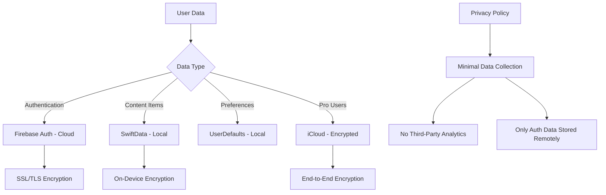

**Privacy Considerations:**

1. **Data Minimization:** Only authentication data stored remotely
2. **Local-First:** All content stored locally using SwiftData
3. **Opt-in iCloud:** Only Pro users get cloud sync (optional)
4. **No Tracking:** Beyond AdMob (with user consent), no analytics
5. **GDPR Compliant:** Right to deletion, data export

---

### 11. Testing Strategy

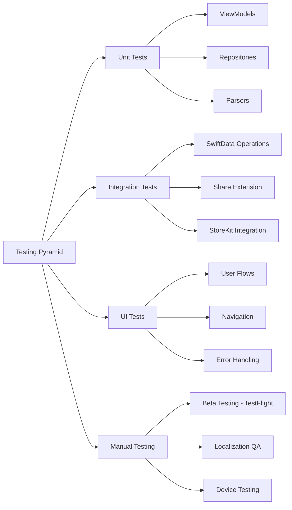

**Testing Implementation:**

```swift
import XCTest
@testable import Vault

final class MetadataParserTests: XCTestCase {
    var parser: MetadataParserService!
    
    override func setUp() {
        super.setUp()
        parser = MetadataParserService()
    }
    
    func testYouTubeURLParsing() async throws {
        let url = URL(string: "https://www.youtube.com/watch?v=dQw4w9WgXcQ")!
        let metadata = try await parser.parse(url: url)
        
        XCTAssertNotNil(metadata.title)
        XCTAssertEqual(metadata.sourceType, .youtube)
    }
    
    func testItemLimitForFreeUsers() {
        let subscriptionManager = SubscriptionManager()
        XCTAssertFalse(subscriptionManager.isPro)
        
        // Test 30-item limit logic
    }
}
```

---

### 12. Deployment & CI/CD Architecture

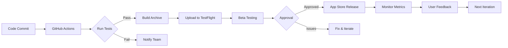

**GitHub Actions Workflow:**

```yaml
name: iOS CI/CD

on:
  push:
    branches: [ main, develop ]
  pull_request:
    branches: [ main ]

jobs:
  build:
    runs-on: macos-latest
    
    steps:
    - uses: actions/checkout@v3
    
    - name: Set up Xcode
      uses: maxim-lobanov/setup-xcode@v1
      with:
        xcode-version: '15.0'
    
    - name: Install dependencies
      run: |
        pod install
    
    - name: Run tests
      run: |
        xcodebuild test \
          -workspace Vault.xcworkspace \
          -scheme Vault \
          -destination 'platform=iOS Simulator,name=iPhone 15 Pro'
    
    - name: Build archive
      run: |
        xcodebuild archive \
          -workspace Vault.xcworkspace \
          -scheme Vault \
          -archivePath ./build/Vault.xcarchive
    
    - name: Upload to TestFlight
      env:
        APPLE_ID: ${{ secrets.APPLE_ID }}
        APP_PASSWORD: ${{ secrets.APP_PASSWORD }}
      run: |
        xcrun altool --upload-app \
          --type ios \
          --file ./build/Vault.ipa \
          --username "$APPLE_ID" \
          --password "$APP_PASSWORD"
```

---

### 13. Performance Optimization

#### Key Performance Metrics

| Metric | Target | Strategy |
|--------|--------|----------|
| **App Launch Time** | < 2s | Lazy loading, minimal startup work |
| **List Scrolling** | 60 FPS | `LazyVStack`, image caching |
| **Share Extension Load** | < 1s | Background metadata fetching |
| **Search Response** | < 300ms | SwiftData indexed queries |
| **Image Loading** | Progressive | AsyncImage with placeholders |

**Performance Implementation:**

```swift
// Image Caching
import SwiftUI

actor ImageCache {
    static let shared = ImageCache()
    
    private var cache: [URL: UIImage] = [:]
    
    func image(for url: URL) -> UIImage? {
        cache[url]
    }
    
    func setImage(_ image: UIImage, for url: URL) {
        cache[url] = image
    }
}

struct CachedAsyncImage: View {
    let url: URL
    @State private var image: UIImage?
    
    var body: some View {
        Group {
            if let image = image {
                Image(uiImage: image)
                    .resizable()
            } else {
                ProgressView()
                    .task {
                        await loadImage()
                    }
            }
        }
    }
    
    private func loadImage() async {
        // Check cache first
        if let cached = await ImageCache.shared.image(for: url) {
            image = cached
            return
        }
        
        // Download if not cached
        do {
            let (data, _) = try await URLSession.shared.data(from: url)
            if let downloaded = UIImage(data: data) {
                await ImageCache.shared.setImage(downloaded, for: url)
                image = downloaded
            }
        } catch {
            print("Failed to load image: \(error)")
        }
    }
}
```

---

### 14. Analytics & Monitoring (Privacy-Focused)

**Recommendation:** Use only minimal, privacy-preserving analytics

```swift
import OSLog

struct AnalyticsEvent {
    let name: String
    let parameters: [String: String]
}

actor AnalyticsManager {
    static let shared = AnalyticsManager()
    private let logger = Logger(subsystem: "com.vault.app", category: "analytics")
    
    func logEvent(_ event: AnalyticsEvent) {
        // Log to OSLog (stays on device)
        logger.info("Event: \(event.name), Parameters: \(event.parameters.description)")
        
        // Optionally aggregate anonymized metrics locally
        // NO third-party analytics services
    }
}

// Usage
Task {
    await AnalyticsManager.shared.logEvent(
        AnalyticsEvent(
            name: "item_saved",
            category: ["category": "watch"]
        )
    )
}
```

---

## 📦 Project Structure

```
VaultApp/
├── App/
│   ├── VaultApp.swift
│   ├── ContentView.swift
│   └── Info.plist
│
├── Features/
│   ├── Authentication/
│   │   ├── Views/
│   │   ├── ViewModels/
│   │   └── Services/
│   │
│   ├── Onboarding/
│   │   └── Views/
│   │
│   ├── ContentManagement/
│   │   ├── Views/
│   │   │   ├── ContentListView.swift
│   │   │   ├── ItemDetailView.swift
│   │   │   └── ItemRowView.swift
│   │   ├── ViewModels/
│   │   └── Models/
│   │
│   ├── Settings/
│   │   ├── Views/
│   │   └── ViewModels/
│   │
│   └── Subscription/
│       ├── Views/
│       └── Managers/
│           └── SubscriptionManager.swift
│
├── Core/
│   ├── Models/
│   │   ├── ContentItem.swift
│   │   └── UserPreferences.swift
│   │
│   ├── Services/
│   │   ├── MetadataParser/
│   │   │   ├── MetadataParserService.swift
│   │   │   ├── YouTubeParser.swift
│   │   │   ├── InstagramParser.swift
│   │   │   ├── AmazonParser.swift
│   │   │   └── AppleBooksParser.swift
│   │   │
│   │   ├── NotificationManager.swift
│   │   └── AnalyticsManager.swift
│   │
│   └── Extensions/
│       ├── String+Localization.swift
│       └── Color+Extensions.swift
│
├── ShareExtension/
│   ├── ShareViewController.swift
│   ├── ShareExtensionView.swift
│   └── Info.plist
│
├── Resources/
│   ├── Assets.xcassets/
│   ├── Localizations/
│   │   ├── en.lproj/
│   │   │   └── Localizable.strings
│   │   └── ru.lproj/
│   │       └── Localizable.strings
│   ├── GoogleService-Info.plist
│   └── Fonts/
│
├── Tests/
│   ├── VaultTests/
│   │   ├── ParserTests.swift
│   │   ├── ModelTests.swift
│   │   └── ViewModelTests.swift
│   │
│   └── VaultUITests/
│       └── NavigationTests.swift
│
└── Podfile
```

---

## 🚀 Implementation Roadmap

### Phase 1: MVP Foundation (Weeks 1-4)

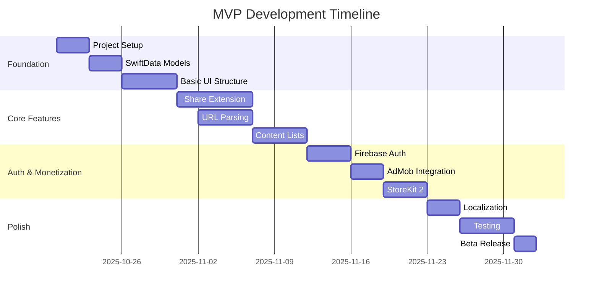

### Detailed Task Breakdown

#### Week 1-2: Foundation
- [x] Xcode project setup with iOS 17.0 target
- [x] SwiftData model definitions
- [x] Basic SwiftUI navigation structure
- [x] Firebase configuration
- [x] App Groups setup for Share Extension

#### Week 3-4: Core Features
- [x] Share Extension implementation
- [x] URL metadata parser service
- [x] Source-specific parsers (YouTube, Instagram, Amazon, Apple Books)
- [x] Content list views for all 4 categories
- [x] Add/Edit/Delete functionality

#### Week 5-6: Authentication & Monetization
- [x] Sign in with Apple implementation
- [x] Google Sign-In integration
- [x] Email authentication
- [x] AdMob banner ads
- [x] StoreKit 2 subscription flow
- [x] 30-item limit enforcement

#### Week 7-8: Polish & Testing
- [x] Russian/English localization
- [x] Notification system
- [x] Settings screen
- [x] Unit tests
- [x] UI tests
- [x] Beta testing via TestFlight

---

## 📊 Success Metrics & KPIs

### MVP Success Criteria

| Metric | Target | Measurement |
|--------|--------|-------------|
| **DAU** | 1,000 users | First 3 months |
| **Retention (D7)** | 30% | Week 1 retention |
| **Conversion to Pro** | 5% | Within first month |
| **Avg Items per User** | 15 items | Engagement metric |
| **Share Extension Usage** | 70% | Primary add method |
| **App Store Rating** | 4.5+ stars | User satisfaction |
| **Crash-Free Rate** | 99.5%+ | Stability |

---

## 🔐 Risk Assessment & Mitigation

| Risk | Probability | Impact | Mitigation Strategy |
|------|-------------|--------|---------------------|
| **Limited URL parsing accuracy** | Medium | High | Implement fallback OpenGraph parser; Allow manual editing |
| **Low conversion to Pro** | High | High | A/B test pricing; Offer limited-time discounts; Improve Pro value prop |
| **Competition from established apps** | High | Medium | Focus on multi-category USP; Target bilingual users; Emphasize privacy |
| **iOS version fragmentation** | Low | Low | iOS 17+ has 85%+ adoption; Clear communication of requirements |
| **AdMob revenue lower than expected** | Medium | Medium | Optimize ad placement; Consider alternative ad networks |
| **iCloud sync issues** | Medium | Medium | Thorough testing; Provide local-only option |

---

## 📱 Technical Specifications

### Hardware Requirements
- **Device:** iPhone running iOS 17.0+
- **Storage:** Minimum 100MB
- **Network:** WiFi or cellular for authentication, metadata fetching, and ads

### Software Requirements
- **iOS Version:** 17.0+
- **Xcode Version:** 15.0+
- **Swift Version:** 5.9+

### Third-Party Dependencies

```ruby
# Podfile
platform :ios, '17.0'
use_frameworks!

target 'Vault' do
  pod 'Firebase/Auth'
  pod 'Google-Mobile-Ads-SDK'
  pod 'GoogleSignIn'
end

target 'ShareExtension' do
  # Share extension dependencies
end
```

**Swift Package Dependencies:**
- `OpenGraphReader` - URL metadata parsing
- `SwiftSoup` - HTML parsing fallback

---

## 🎨 Design System

### Color Palette

```swift
extension Color {
    static let vaultPrimary = Color("AccentColor")
    static let vaultBackground = Color("BackgroundColor")
    static let vaultSecondary = Color("SecondaryColor")
    static let vaultText = Color.primary
    static let vaultSecondaryText = Color.secondary
}
```

### Typography

```swift
extension Font {
    static let vaultTitle = Font.system(size: 28, weight: .bold, design: .rounded)
    static let vaultHeadline = Font.system(size: 17, weight: .semibold)
    static let vaultBody = Font.system(size: 17, weight: .regular)
    static let vaultCaption = Font.system(size: 12, weight: .regular)
}
```

### Spacing System

```swift
enum Spacing {
    static let xs: CGFloat = 4
    static let sm: CGFloat = 8
    static let md: CGFloat = 16
    static let lg: CGFloat = 24
    static let xl: CGFloat = 32
}
```

---

## 📚 Documentation Requirements

### Developer Documentation
1. **Architecture Overview** - This document
2. **API Documentation** - Code comments and DocC
3. **Setup Guide** - README.md
4. **Contributing Guidelines** - CONTRIBUTING.md

### User Documentation
1. **App Store Description**
2. **Privacy Policy**
3. **Terms of Service**
4. **FAQ / Help Center**
5. **Tutorial Videos**

---

## 🤝 Team Roles & Responsibilities

| Role | Responsibilities | Team Size |
|------|-----------------|-----------|
| **iOS Developer** | SwiftUI implementation, SwiftData, StoreKit | 1-2 |
| **Backend Developer** | Firebase configuration, server-side validation | 0.5 (minimal backend) |
| **UI/UX Designer** | Figma designs, user flows, testing | 1 |
| **QA Engineer** | Testing, bug reporting, TestFlight management | 0.5 |
| **Product Manager** | Roadmap, prioritization, stakeholder communication | 1 |

---

## 🔄 Next Steps & Approval

### Immediate Actions Required

1. **Review & Approve Architecture**
   - [ ] Approve technology stack
   - [ ] Approve architectural patterns
   - [ ] Approve MVP feature set

2. **Setup Development Environment**
   - [ ] Create Apple Developer account
   - [ ] Setup Firebase project
   - [ ] Create AdMob account
   - [ ] Configure App Store Connect

3. **Design Phase**
   - [ ] Create Figma mockups
   - [ ] Define color palette
   - [ ] Design app icon
   - [ ] Create marketing assets

4. **Development Kickoff**
   - [ ] Initialize Xcode project
   - [ ] Setup Git repository
   - [ ] Configure CI/CD pipeline
   - [ ] Begin Sprint 1

---

## 📞 Questions for Stakeholder Review

Before proceeding with development, please confirm the following:

1. **Pricing Strategy:**
   - What is the monthly subscription price?
   - What is the yearly subscription price?
   - What is the lifetime purchase price?
   - Will there be a free trial period?

2. **Supported Platforms (MVP):**
   - Confirmed iOS-only for MVP?
   - iPad optimization included?
   - Future plans for Android/Web?

3. **Business Priorities:**
   - Primary monetization goal: Subscriptions vs. Ads?
   - Target market priority: English vs. Russian users?
   - Launch timeline: Is 8-week MVP realistic?

4. **Technical Decisions:**
   - Approve SwiftData over Core Data?
   - Approve Firebase Auth over custom backend?
   - Approve AdMob over alternative ad networks?

---

## ✅ Approval & Sign-Off

| Stakeholder | Role | Approval | Date | Signature |
|-------------|------|----------|------|-----------|
| Dzmitry Zaitsau | Product Owner | ☐ Approved<br>☐ Changes Requested | | |
| Technical Lead | Architecture Review | ☐ Approved<br>☐ Changes Requested | | |
| Design Lead | UI/UX Review | ☐ Approved<br>☐ Changes Requested | | |

---

## 📎 Appendices

### Appendix A: Competitor Analysis

| Competitor | Strengths | Weaknesses | Our Advantage |
|-----------|-----------|------------|---------------|
| **Instapaper** | Established, simple | Read-only, minimal features | Multi-category support |
| **Readwise Reader** | AI features, comprehensive | Complex, expensive | Simpler, focused |
| **Pinterest** | Visual, large user base | Not designed for "later" | Purpose-built for saving |
| **Notion** | Flexible, powerful | Steep learning curve | Easier, category-focused |

### Appendix B: Market Research Sources

1. Productivity apps market analysis (2024-2025)
2. Pocket shutdown announcement (July 2025)
3. iOS market adoption rates (Q3 2025)
4. Russian app market reports (2024)
5. StoreKit 2 documentation (WWDC 2025)

### Appendix C: Technical References

1. [Apple SwiftData Documentation](https://developer.apple.com/documentation/swiftdata)
2. [StoreKit 2 WWDC Session](https://developer.apple.com/videos/play/wwdc2025/241/)
3. [Firebase iOS Setup Guide](https://firebase.google.com/docs/ios/setup)
4. [AdMob iOS Integration](https://developers.google.com/admob/ios)
5. [Share Extension Programming Guide](https://developer.apple.com/documentation/uikit/inter-process_communication/allowing_apps_and_websites_to_link_to_your_content)

---

## 📝 Document History

| Version | Date | Author | Changes |
|---------|------|--------|---------|
| 1.0 | 2025-10-18 | Solution Architecture Team | Initial comprehensive architecture document |

---

## 🎯 Summary & Recommendation

**Vault of Digital Content** represents a significant market opportunity in the post-Pocket landscape. The proposed architecture leverages modern iOS technologies (SwiftUI, SwiftData, StoreKit 2) to deliver a **privacy-first, multi-category content management solution** targeting both English and Russian-speaking users.

### Key Architectural Strengths:
✅ **Modern Tech Stack** - iOS 17+ features, SwiftData, Structured Concurrency  
✅ **Scalable Design** - Repository pattern, feature-based modules  
✅ **Privacy-Focused** - Minimal cloud storage, local-first approach  
✅ **Monetization-Ready** - AdMob + StoreKit 2 dual revenue model  
✅ **Bilingual Support** - Native localization for Russian/English  

### Recommended Approval with Following Conditions:
1. Confirm pricing strategy for Pro subscription
2. Allocate 8-10 weeks for MVP development
3. Budget for TestFlight beta testing (200+ users)
4. Plan marketing strategy targeting Pocket refugees

**Next Step:** Please review and approve to proceed with Xcode project setup and Sprint 1 kickoff.

---

**Document Prepared By:**  
Solution Architecture Team  
Date: October 18, 2025  
Contact: dzmitry_zaitsau2@epam.com

---

Would you like me to:
1. **Elaborate on any specific section** (e.g., more detailed SwiftUI code examples)?
2. **Create additional diagrams** (e.g., database schema, user flow diagrams)?
3. **Provide implementation code** for specific features (e.g., complete ShareExtension, specific parsers)?
4. **Design the Figma mockups** using AI tools mentioned?
5. **Create a detailed sprint backlog** with user stories and acceptance criteria?

Please let me know how you'd like to proceed! 🚀


# 📋 Backlog

Below, user stories are grouped by **MVP (Free)** and **Pro features**, sequenced for implementation, and formatted for engineering tools.

---

## 🟦 MVP (Free) User Stories

---

### 1. User Onboarding & Initial Setup

~~~markdown
**Title:** Onboarding Flow with Language and Notification Selection  
**Short Description:**  
Enable users to select app language and notification frequency/day during the onboarding process upon first launch.

**Acceptance Criteria:**
- When the app is opened for the first time, then show onboarding screens.
- When onboarding, and user selects language (Russian or English), then app UI updates accordingly.
- When onboarding, and user selects notification frequency and enables/disables notifications, then preferences are saved and respected.
- When onboarding is dismissed, user is taken to authentication or main dashboard based on sign-in state.

**Detailed UI/UX Description:**  
- Welcome modal illustrating app value.
- Language selection (toggle or list) shown first.
- Notification frequency picker (day/week/month) and enable/disable toggle.
- Progress indicator and ability to skip/continue.
- Store onboarding completion status in user defaults.

**Dependencies:** None
~~~

---

### 2. Authentication (Google, Apple, Email, Guest Gate)

~~~markdown
**Title:** Authentication and Guest-Access Gate  
**Short Description:**  
Allow sign-in with Apple, Google, or Email. Allow guest browsing, but require authentication before saving the first item.

**Acceptance Criteria:**
- When user launches the app, then prompt for authentication or “continue as guest” button is available.
- When using any app feature that creates, edits or deletes content, and not authenticated, then show sign-in requirement modal.
- When user authenticates, then persist and sync user identity and unlock all content features.
- When user is authenticated, then profile icon in top right displays status/badge.

**Detailed UI/UX Description:**  
- Authentication modal with Apple, Google, Email buttons, plus “Continue as Guest.”
- When attempting to add/save content as guest, sign-in modal appears.
- Retain guest local app flow until save attempted.
- Profile avatar/badge in UI post-login.

**Dependencies:** Onboarding Flow  
~~~

---

### 3. Main Dashboard – Four Categories

~~~markdown
**Title:** Main Dashboard with 4 Distinct Content Categories  
**Short Description:**  
User lands on a dashboard with clear tabs (Watch Later, Read Later, Buy Later, Cook Later), each showing its own item list.

**Acceptance Criteria:**
- When user is on the dashboard, tabs for “Watch Later”, “Read Later”, “Buy Later”, “Cook Later” are visible and selectable.
- When switching tabs, then show correct content list for selected category.
- Each tab displays item count and free tier limit used (e.g., “3/10 FREE”).

**Detailed UI/UX Description:**  
- Fixed top bar with app logo, search bar, language toggle, and profile icon (with status badge or “Upgrade to Pro” if applicable).
- Content tab bar with icons and label for each category.
- Each tab shows a scrollable list or an empty state if no items exist.
- List shows item cards (image, title, description, source/domain).
- Bottom “+ Add Item” button present in all tabs.

**Dependencies:** Authentication
~~~

---

### 4. Add Item – In-App Flow with Free Source Check

~~~markdown
**Title:** Add New Item (In App) with Source Validation  
**Short Description:**  
Allow users to add a new item by pasting a URL or entering manually, auto-parsing only if from one of 4 free sources; fallback to manual if not.

**Acceptance Criteria:**
- When user taps “Add Item,” show modal for entering/pasting URL and selecting category.
- When a supported source URL is provided and “Fetch from URL” is pressed, then image/title/description auto-fill.
- When an unsupported URL is provided, then show toast/snackbar: "Only YouTube, Instagram, Amazon, Apple Books are available in the free version. Please upgrade to Pro for more."
- When unsupported source, allow user to enter info manually (fields editable, no auto-fetch).
- When item is saved, then add it to selected category list (if under limit).

**Detailed UI/UX Description:**  
- “Add Item” modal (see screenshot), with “Paste URL”, “Fetch from URL”, editable fields for Category, Title, Description, Image.
- Supported sources: Show prefill UI (with logo), else fallback.
- Error toast/snackbar for unsupported sources.
- Handle per-category free tier limit (see next story).

**Dependencies:** Main Dashboard
~~~

---

### 5. Add Item – via Share Extension

~~~markdown
**Title:** Add New Item via iOS Share Extension  
**Short Description:**  
Allow user to save content from other apps using iOS Share Sheet, with auto-metadata for supported sources and fallback handling for others.

**Acceptance Criteria:**
- When user shares a URL from another app, then Share Extension UI opens with metadata prefilled only for supported sources.
- When sharing an unsupported source, show toast/snackbar: "Only 4 sources are available in the free version. Please upgrade to Pro." and present manual entry fields.
- When user completes the flow and confirms, item is saved to the selected category, respecting per-category item limit.

**Detailed UI/UX Description:**  
- Share sheet shows the add/edit UI modal, preselecting “Watch/Read/Buy/Cook” as appropriate.
- Supported sources get image/title/description, else user must fill manually.
- Respect per-category item limit on save attempt.

**Dependencies:** Authentication, Data layer
~~~

---

### 6. Category Item Limit (Free) Enforcement

~~~markdown
**Title:** Per-Category Item Limit Enforcement for Free Users  
**Short Description:**  
Limit each category to 10 items for free users. Show upgrade prompt if user exceeds limit.

**Acceptance Criteria:**
- When adding a new item, and category contains < 10 items, save is allowed.
- When adding and category has 10 items, show alert/popup with message: “Free users are limited to 10 items in each category. Upgrade to Pro for unlimited storage.”
- When item deleted from category, then freeing up slot for new items.

**Detailed UI/UX Description:**  
- Item counter “(3/10 FREE)” displayed at top of category list.
- Alert/modal with Upgrade CTA shown at limit, includes “Upgrade to Pro” and “Cancel.”

**Dependencies:** Add Item flows
~~~

---

### 7. Content List, Search & Filter

~~~markdown
**Title:** List, View, and Search Saved Content in Each Category  
**Short Description:**  
Users can view a scrollable list of saved content for each category, search entries, and filter by date added.

**Acceptance Criteria:**
- When navigating to a category tab, show corresponding list of items or empty state.
- When using search bar, then filter list by title/description.
- When applying filter (date), then only items from specified date range are shown.

**Detailed UI/UX Description:**  
- List of cards with image, title, description, and domain/source.
- Search bar at top.
- Date filter (optional: modal or drop-down).
- Empty state with prompt and add CTA.

**Dependencies:** Main Dashboard, Data Layer  
~~~

---

### 8. Item Detail, Edit, and Delete

~~~markdown
**Title:** Item Detail View, Editing, and Deletion  
**Short Description:**  
Allow users to view full details of an item, edit its fields, and delete from the vault.

**Acceptance Criteria:**
- When selecting an item from a list, then item detail view is shown.
- When user taps “Edit,” all fields are editable and can be saved again.
- When user taps “Delete,” confirm removal and remove item from vault/category.

**Detailed UI/UX Description:**  
- Modal or dedicated screen with full-size image and all text fields.
- Edit button opens fields for editing.
- Delete button with confirmation dialog.

**Dependencies:** Content List
~~~

---

### 9. Category Sub-Groupings/Customizations (Within 4 Base Categories)

~~~markdown
**Title:** Category Sub-Groups/Types (Watch: Films, YouTube, etc.)  
**Short Description:**  
Enable user to assign items to sub-groups (e.g., Watch: Films, YouTube, Talks), visible in add/edit forms and as filters.

**Acceptance Criteria:**
- When user adds or edits an item, there’s a field to select sub-group/type (with defaults per category, e.g., Watch → Films, YouTube).
- When filtering within tab, user can view only items in selected sub-group.

**Detailed UI/UX Description:**  
- Drop-down or pill selector for sub-category in add/edit forms.
- Sub-group label shown on cards.

**Dependencies:** Content List, Add/Edit item
~~~

---

### 10. Advertisements in Main Screen (Free Users Only)

~~~markdown
**Title:** Show AdMob Banner Ads in Main Screen for Free Users  
**Short Description:**  
Integrate AdMob banners at the bottom of content lists/dashboard for Free users.

**Acceptance Criteria:**
- When user is not Pro, show AdMob banner at bottom of dashboard and category tab screens.
- When user upgrades to Pro, banner is removed from all screens instantly.

**Detailed UI/UX Description:**  
- Persistent banner above bottom bar; non-intrusive format.

**Dependencies:** Dashboard, User subscription status
~~~

---

### 11. Notifications — User Preferences

~~~markdown
**Title:** Configurable Reminder Notifications per User Preference  
**Short Description:**  
Let user choose between daily, weekly, or monthly random reminders during onboarding and change in settings.

**Acceptance Criteria:**
- When setting up app or via settings, user can configure reminder frequency (day/week/month), or disable entirely.
- When enabled, app sends a local notification at random times, picking a random item from any category, not exceeding frequency.

**Detailed UI/UX Description:**  
- Reminder frequency selector in onboarding/settings.
- On-device scheduling using local notifications.
- Notification opens app to item detail on tap.

**Dependencies:** Onboarding, Settings
~~~

---

### 12. Language Switching in App & Onboarding

~~~markdown
**Title:** In-App Language Switching and Persistent Localization  
**Short Description:**  
Allow users to switch languages (Russian/English) at any time from the main screen and in onboarding. All UI updates immediately.

**Acceptance Criteria:**
- When user taps language icon in top bar, show language selector.
- When new language is selected, entire app switches instantly without restart.
- User’s choice is remembered for next launch.

**Detailed UI/UX Description:**  
- Globe or “РУ/EN” icon in top right triggers modal.
- All strings localized and update live.

**Dependencies:** Onboarding, Top Bar UI
~~~

---

### 13. Settings Screen — Basic Preferences

~~~markdown
**Title:** Settings Screen for Language, Notifications and Account  
**Short Description:**  
Users can change language, review notification preferences, and see their account/subscription status.

**Acceptance Criteria:**
- When user opens Settings (profile icon), then language toggle, notification controls, and account info are present.
- When preferences are changed, app reflects changes immediately.

**Detailed UI/UX Description:**  
- Settings modal or tab, with Language, Notifications, and Profile/Subscription section
- “Upgrade to Pro” CTA if not yet Pro, “PRO” badge/status if Pro.

**Dependencies:** Language Switching, Notifications, Authentication
~~~

---

### 14. Profile Badge & Detail

~~~markdown
**Title:** Profile Icon with Upgrade/Pro Badge, Profile Modal  
**Short Description:**  
Always display a profile avatar in the top bar with a status badge (“Upgrade to Pro”/“Pro”), which opens the profile/settings page.

**Acceptance Criteria:**
- When user is free, badge says “Upgrade to Pro,” tapping opens profile/subscription modal.
- When user is Pro, badge says “PRO.”
- Profile modal shows account info, subscription details, and link to manage Pro.

**Detailed UI/UX Description:**  
- Always visible circular avatar with badge in header.
- Tappable for account and plan details.

**Dependencies:** Authentication, Subscription
~~~

---

### 15. (Base) Subscription/Pro Upsell Modal

~~~markdown
**Title:** Pro Features and Upgrade Modal  
**Short Description:**  
Accessible via “Upgrade to Pro” badge/button or when item limit reached. Shows features, prices, and triggers subscription purchase flow.

**Acceptance Criteria:**
- When accessed (from badge, upgrade CTA, or item limit block), modal with Pro feature highlights and clear pricing (monthly, yearly, lifetime) is shown.
- Successful purchase updates user immediately to Pro (UI indicators, ads gone, limits removed).
- When user is Pro, feature modal shows “You are a Pro user”.

**Detailed UI/UX Description:**  
- Modal with feature checklist.
- Monthly ($4.99), yearly ($17.99), lifetime ($29.99) pricing selectors.
- “Subscribe” button, closes on success and updates UI.

**Dependencies:** Profile Badge, Item Limit Enforcement, Settings
~~~

---

## 🟧 Pro Features (Subscription Tier)

---

### 16. Remove All Item Limits (Pro)

~~~markdown
**Title:** Remove Item Count Limits for Pro Users  
**Short Description:**  
When a user purchases Pro, there are no restrictions on the number of items per category or total.

**Acceptance Criteria:**
- When user is Pro, any number of items can be added to any category.
- Item limit/prompt/messages disappear instantly post-upgrade.

**Detailed UI/UX Description:**  
- No “/10 FREE” counters shown.
- “Pro” badge always displayed in profile.

**Dependencies:** Subscription/Pro Upsell Modal
~~~

---

### 17. Remove Advertisements (Pro)

~~~markdown
**Title:** Hide Ads for Pro Users  
**Short Description:**  
When a user is Pro, remove all AdMob banners from every screen.

**Acceptance Criteria:**
- When user is Pro, no ad banners are displayed anywhere in the app immediately after upgrade.

**Detailed UI/UX Description:**  
- Instant UI update; no empty/broken layout below where ad was.

**Dependencies:** Advertisements in Main Screen
~~~

---

### 18. Extended Source Parsing for Pro Users

~~~markdown
**Title:** Support Additional Content Sources for Pro Users  
**Short Description:**  
For Pro users, allow parsing of shared URLs and auto-filling of metadata from more sources beyond the free 4.

**Acceptance Criteria:**
- When user is Pro, all URLs from a larger list of sources parse metadata automatically in add/share flows.
- For any supported Pro source, auto-fill image, title, description works seamlessly.

**Detailed UI/UX Description:**  
- Add/Edit modals, share extension prefill metadata for all supported Pro sources.
- Show more source icons/logos if available.

**Dependencies:** Purchase Pro
~~~

---

### 19. Custom Subcategories/Tags (Within 4 Base)

~~~markdown
**Title:** Advanced Category Customization for Pro Users  
**Short Description:**  
Pro users can define custom subcategories/tags within Watch, Read, Buy, or Cook (e.g. Watch: “Movies”, “Talks”, etc.).

**Acceptance Criteria:**
- When user is Pro, an “Add subcategory/tag” UI is present in Add/Edit flow.
- Custom groups are immediately usable for filtering/sorting within categories.

**Detailed UI/UX Description:**  
- UI for adding/editing custom subcategories/tags.
- Sub-group pill/buttons in filter/search area.

**Dependencies:** Category Sub-Grouping
~~~

---

### 20. iCloud Sync (Pro)

~~~markdown
**Title:** iCloud Sync and Cross-Device Access for Pro Users  
**Short Description:**  
Pro users’ saved content and preferences are auto-synced to iCloud for backup and multi-device access.

**Acceptance Criteria:**
- When user is Pro and iCloud is available, all items + preferences sync to iCloud.
- Adding, editing, or deleting items on one device appear on others using same account.
- Sync state/status shown in settings/profile.

**Detailed UI/UX Description:**  
- Sync status badge in settings/profile.
- Auto/manual trigger toggle optional.

**Dependencies:** Pro purchase, Profile/Settings
~~~

---

### 21. Family Sharing (Pro)

~~~markdown
**Title:** Enable Pro Features for Family Sharing Accounts  
**Short Description:**  
Pro users with Family Sharing enabled spread Pro features to all members.

**Acceptance Criteria:**
- When Pro plan includes Family Sharing, other users with same Apple Family group on same plan receive Pro status/features automatically.

**Detailed UI/UX Description:**  
- “Shared with Family” note in subscription/profile screen.

**Dependencies:** Pro purchase, iCloud Sync
~~~

---

## ⚡️ Cross-cutting Stories

---

### 22. Localization Everywhere

~~~markdown
**Title:** Complete Localization Across All UI/UX  
**Short Description:**  
Ensure both Russian and English are supported in every UI string, notification, toast, and error state.

**Acceptance Criteria:**
- When language is switched (by user at any time), all app elements reflect the selected locale instantly.
- All onboarding, modals, alerts, notifications, errors, and CTA are accurately localized.

**Detailed UI/UX Description:**  
- No English-only strings in the RU experience, and vice versa.
- Language setting persists across app restarts.

**Dependencies:** Language Switcher, All UI components
~~~

---

### 23. Accessibility & Usability Compliance

~~~markdown
**Title:** App-level Accessibility Support  
**Short Description:**  
All critical user flows (add, search, category switch, purchase) and UI components are accessible (VoiceOver, contrast, touch target).

**Acceptance Criteria:**
- When using VoiceOver or increasing text size, all core flows are navigable and legible.
- All focus, labels, and interactive controls provide correct accessibility labels.

**Detailed UI/UX Description:**  
- Use SF Symbols with VoiceOver text.
- Focus management for keyboard/search.

**Dependencies:** All features  
~~~
